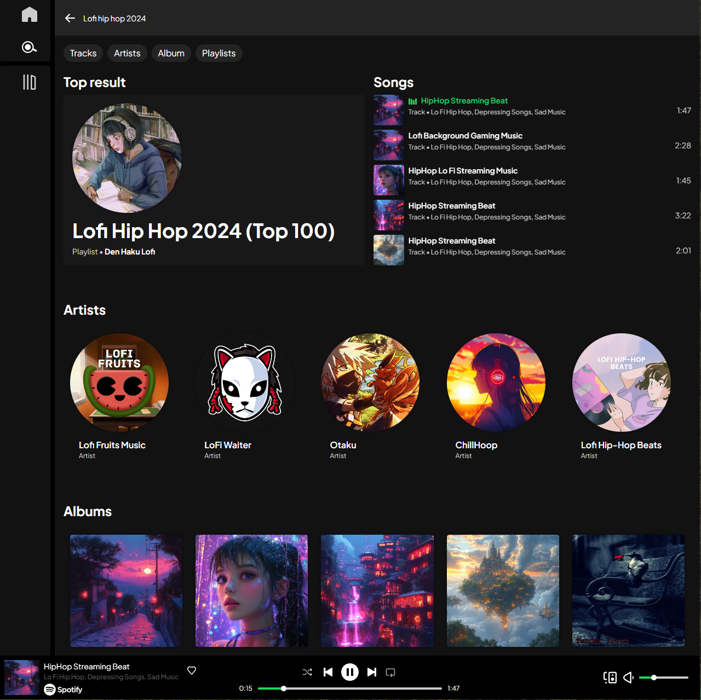
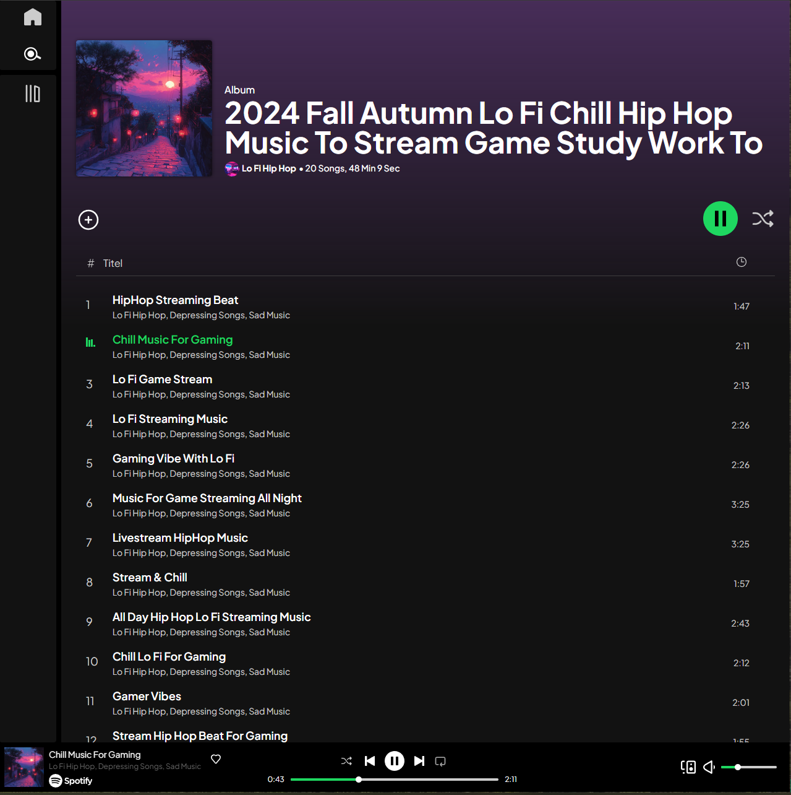

# Spotify web

This application was built using the Spotify API, allowing users to log in with their Spotify accounts to search for tracks, albums, artists, and playlists. The app displays real-time data from each user’s Spotify library and integrates seamlessly with Spotify features like music playback, personalized recommendations, and access to saved playlists and top artists.

<b>Note:</b> The application is currently in Spotify Development Mode, which means that only 25 users can have full access to all features at any given time. To gain access, users must be added to an allowlist. If you would like full access, please reach out to request this. For other users, a guest version is available with limited functionality, allowing exploration of features without music playback and Spotify’s personalized content.

## Features

- <b>Music discovery</b> - Search for tracks, albums, artists, and playlists.
- <b>Music bar animation</b> - While on desktop ( 1024px or more ) music bars will animate when playing music on playlist, album, artist or search page.
- <b>Recommendations</b> - Get personalized song recommendations based on your top five genres.
- <b>Recently played tracks</b> - View your 25 most recently played tracks.
- <b>Top artists</b> - View up to 25 of your top artists.
- <b>Save track</b> - Save a track to your "liked tracks" playlist.

## Prerequisites

The versions listed below are the ones I'm using. It may also work with older versions.

- Vite (version 5.4)
- React (version 18.3)
- TypeScript (version 5.5)
- TailwindCSS (version 3.4)
- Spotify developer account for API access

## Installation

Clone this repo:

```bash
git clone https://github.com/FriceIce/spotify-web.git
```

Install dependencies:

```bash
npm install
```

Set up your enviroment variables:

```bash
npm i dotenv
```

```plaintext
  VITE_CLIENT_ID = "Your_client_id"
  VITE_CLIENT_SECRET = "your_client_secret"
```

run it locally:

```bash
  npm run dev
```

## Usage

When you sign in with your Spotify account, you’ll be welcomed to the home page featuring playlists, albums, top artists, recommendations, and recently played tracks. On the left side of the screen, you'll find your library (which I have disabled for privacy reasons) and the search icon, which turns white when clicked. While active, you can search for anything except podcasts and Spotify users. Clicking on a track will play it directly from the search list, and clicking on an album, playlist, or artist will display more information about them.




## API Documentation

I'm using the npm package [spotify-web-api-js](https://www.npmjs.com/package/spotify-web-api-js) to communicate with Spotify's API. It simplifies the process, but I still recommend reading the Spotify Web API documentation for each endpoint that you wish use. Visit [Spotify Web API](https://developer.spotify.com/documentation/web-api) for more detailed information.

Initiate the instance:

```javascript
const spotifyApi = new SpotifyWebApi();
```

Set access token:

```javascript
spotifyApi.setAccessToken("<your_access_token>");
```

Fetch album:

```javascript
spotifyApi.getAlbum("4aawyAB9vmqN3uQ7FjRGTy", { market: "ES" }).then(
  (album) => {
    console.log("Album details: " + album);
  },
  (error) => {
    console.error(error);
  }
);
```

Fetch Artist:

```javascript
spotifyApi.getArtist("2hazSY4Ef3aB9ATXW7F5w3").then(
  (artist) => {
    console.log("Artist information", artist);
  },
  (error) => {
    console.error(error);
  }
);
```

## Technologies used

- **Build tool** - [Vite](https://vite.dev/guide/why.html), check it out
- **UI** - React with TypeScript and TailwindCSS
- **State Management** - [Redux Toolkit](https://redux-toolkit.js.org/introduction/getting-started) to keep track of playback state, user, search and home content
- **Token Storage** - I used the npm package [react-cookie](https://www.npmjs.com/package/react-cookie) to store the access token and refresh token in cookies to maintain login sessions

## Application status

The application is still in development.
